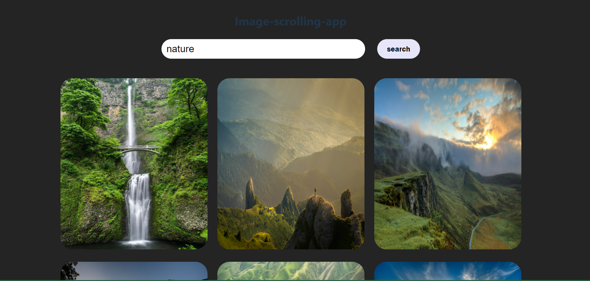

 <!-- Adjust the path as needed -->
```markdown
# Image Scrolling App
This is an image gallery application built with React, Vite, and the Unsplash API. The app features infinite scrolling to load more images as the user scrolls down the page.

## Features

- Infinite scrolling to load more images dynamically.
- Search functionality to fetch images based on user queries.
- Responsive design for different screen sizes.

## Demo

You can check out the live demo [here](https://image-scrolling-app61.netlify.app/).

## Getting Started

### Prerequisites

- Node.js and npm installed on your machine.
- An Unsplash API Access Key. You can sign up and get your access key [here](https://unsplash.com/developers).

### Installation

1. Clone the repository:

   ```bash
   git clone https://github.com/md-faizan-khan61/image-scrolling-app.git
   cd image-scrolling-app
   ```

2. Install the dependencies:

   ```bash
   npm install
   ```

3. Create a `.env` file in the root of the project and add your Unsplash API Access Key:

   ```plaintext
   VITE_UNSPLASH_ACCESS_KEY=your_unsplash_access_key
   ```

4. Run the development server:

   ```bash
   npm run dev
   ```

5. Open your browser and navigate to `http://localhost:3000` to see the app in action.

## Usage

- Use the search bar to enter a query and fetch images related to that query.
- Scroll down to load more images dynamically.

## Project Structure

```plaintext
src/
│── ImageGallery.jsx
│── App.css
├── App.jsx
├── main.jsx
└── index.css
    
```

- `ImageGallery.jsx`: The main component that handles image fetching and infinite scrolling.
- `App.jsx`: The main App component.
- `main.jsx`: The entry point for the React application.
- `App.css`: CSS file for styling the image gallery.

## API

This app uses the Unsplash API to fetch images. Make sure to follow the [Unsplash API guidelines](https://unsplash.com/documentation) and respect their rate limits.

## Contributing

Contributions are welcome! Please open an issue or submit a pull request for any improvements or bug fixes.

## License

This project is licensed under the MIT License - see the [LICENSE](LICENSE) file for details.

## Acknowledgements

- [React](https://reactjs.org/)
- [Vite](https://vitejs.dev/)
- [Unsplash](https://unsplash.com/)
- [react-infinite-scroll-component](https://www.npmjs.com/package/react-infinite-scroll-component)

